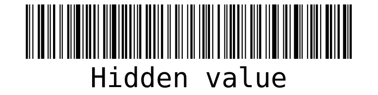

# LABORATORY-REACT-BARCODE



This project is a laboratory on a small package called **React-barcode**. I started this project as a joke just for seeing how to show barcodes on **React**. And I never imagine barcode to be that complicated and interesting. A barcode can have a lot of different formats and they all have different purposes. Who would have imagine that this little barcode behind every item we buy can be so complicated ?

## Plan of the presentation

I explain with all the details how I build the project and my way of working.

- [Theory](#theory)
- [Experiences](#experiences)
- [Running](#running)
- [System](#system)

## Theory

#### Definition (copy/paste wikipedia)

A barcode or bar code is a method of representing data in a visual, machine-readable form. Initially, barcodes represented data by varying the widths, spacings and sizes of parallel lines. These barcodes, now commonly referred to as linear or one-dimensional (1D), can be scanned by special optical scanners, called barcode readers, of which there are several types

#### Formats

A barcode can have a lot of different formats such as EAN13, ITF, CODE128 and so on. Each format have his own checksum and purpose. As I dig into it, I categorize the format as such:

- **Various use [Any kind of character]**: CODE128
- **Id of products [only number]**: EAN, UPC
- **Global trade number [14 digits]**: ITF
- **Inventory warehouse [only number]**: MSI
- **Pharmaceutical industry [numbers from 3 to 131070]**: Pharmacode
- **Deprecated/Useless**: Codabar, CODE39

If nothing has been specified, I will mostly used the CODE128 format for his versality and the fact that any character can be use. Even the uppercase and lower have importance.

For testing the barcode of my app, I have been using a scanner from the google play store: **QR Code Reader**
The interesting part of this scanner is the format is shown beside the value of the barcode. It makes the test of the format quite easy.

## Experiences

- **Experience1**: I am just playing with all the options possible with the library for seeing what we can do
- **Experience2**: I have regrouped the most interesting formats in one single page to rapidly find the one I want

## Running

I am using NX, so for starting the project use the following command:

```
$ nx serve app-react-barcode
```

## System

Ubuntu Version: Ubuntu 20.04.1 LTS
Node Version: v16.15.1

```bash
# Get the version of node
$ node -v

# Get the latest version of ubuntu
$ lsb_release -a
```