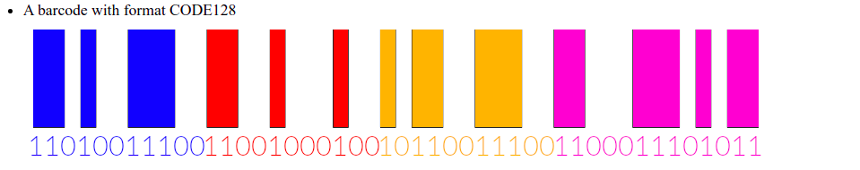

# LABORATORY-REACT-BARCODE


This project is a laboratory on a small package called **React-barcode**. I started this project as a joke just for seeing how to show barcodes on **React**. And I never imagine barcode to be that complicated and interesting. A barcode can have a lot of different formats and they all have different purposes. Who would have imagine that this little barcode behind every item we buy can be so complicated ?

## Plan of the presentation

I explain with all the details how I build the project and my way of working.

- [Theory](#theory)
- [Experiences](#experiences)
- [Running](#running)
- [System](#system)

## Theory

#### Definition (copy/paste wikipedia)

A barcode or bar code is a method of representing data in a visual, machine-readable form. Initially, barcodes represented data by varying the widths, spacings and sizes of parallel lines. These barcodes, now commonly referred to as linear or one-dimensional (1D), can be scanned by special optical scanners, called barcode readers, of which there are several types

#### Formats

A barcode can have a lot of different formats such as EAN13, ITF, CODE128 and so on. Each format have his own checksum and purpose. As I dig into it, I categorize the format as such:

- **Various use [Any kind of character]**: CODE128
- **Id of products [only number]**: EAN, UPC
- **Global trade number [14 digits]**: ITF
- **Inventory warehouse [only number]**: MSI
- **Pharmaceutical industry [numbers from 3 to 131070]**: Pharmacode
- **Deprecated/Useless**: Codabar, CODE39

If nothing has been specified, I will mostly used the CODE128 format for his versality and the fact that any character can be use. Even the uppercase and lower have importance.

For testing the barcode of my app, I have been using a scanner from the google play store: **QR Code Reader**
The interesting part of this scanner is the format is shown beside the value of the barcode. It makes the test of the format quite easy.

#### Code128

**How to read a CODE128 barcode**



I have purposedly increased the size of the barcode to make it simpler to read. The value of this barcode is **10**.
In the barcode above, I have splitted each part in different colors:

- **Blue**: Start Code (value: 105 | pattern: 11010011100)
- **Red**: The value of the barcode (value: 10 | pattern: 11001000100)
- **Orange**: The Checksum (value: 12 | 10110011100)
- **Violet**: Stop Code (value: - | 1100011101011)

The Stop code is the only pattern with 13 digits.

The barcode is encoded as follow:

```
[Start C] [FNC1] 10 [Check symbol] [Stop]
```

The FNC1 which is a number indicating a GS1-128 bar code which begins with a 2- 3- or 4-digit application identifier assigned by the Uniform Code Council.

**How to caculate Checksum**

- Take the value of the bar code dans the start code (In my case, it's a code128 C, so the value of the start code is 105. If it was mod A: 103 and mod B: 104)
- 105 | 10
- Add a weight of 1 for the start code and a weight of 1 incremented for every 2 digits of the value of the bar code
- 105 * 1 | 10 * 1   (if there were more, it would be multiply 2 then multiply by 3...)
- Sum everything: 105 + 10 = 115
- Calculate the modulo by 103: 115 mod 103 = **12**

#### Checksum in MSI mod

If you use the QR Code Reader over the MSI code, you should get some strange values. Those values are in fact the calculated checksum. Let's take for example, 1234567 for two differents MSI mod.

**MSI mod 10**

- 1234567
- Split the digits: 1 | 2 | 3 | 4 | 5 | 6 | 7
- From right, multiply every secode digit by 2: 1 * 2 | 2 | 3 * 2 | 4 | 5 * 2 | 6 | 7 * 2
- 2 | 2 | 6 | 4 | 10 | 6 | 14
- Split the digits: 2 | 2 | 6 | 4 | 1 | 0 | 6 | 1 | 4
- Sum all the digits: 26
- Do a module based on the mod: 26 mod 10 = 4
- Add the result at the end of the number: 1234567**4**

**MSI mod 11**

This time the calculation changes, we the same starting number as earlier 1234567.

- 1234567
- Split the digits: 1 | 2 | 3 | 4 | 5 | 6 | 7
- From right, put a weight of 2 to 7 incrementaly and start again from 2 when you reach 7: 2 | 7 | 6 | 5 | 4 | 3 | 2
- Multiply the digits by the weight associated: 1 * 2 | 2 * 7 | 3 * 6 | 4 * 5 | 5 * 4 | 6 * 3 | 7 * 2
- 2 | 14 | 18 | 20 | 20 | 18 | 14
- Sum every numbers: 106
- Do a module based on the mod: 106 mod 11 = 4
- Add the result at the end of the number: 1234567**4**

**MSI mod 1010**

For the modulo 1010, the principle is the same. We just do it twice (10 - 10) consecutively.
The result will be 12345674**1**

**MSI mod 1110**

Once again, you simply do the calculation twice and change mod in the middle.

## Experiences

- **Experience1**: I am just playing with all the options possible with the library for seeing what we can do
- **Experience2**: I have regrouped the most interesting formats in one single page to rapidly find the one I want
- **Experience3**: Playing with the check of the validity of a codebar

## Running

I am using NX, so for starting the project use the following command:

```
$ nx serve app-react-barcode
```

## System

Ubuntu Version: Ubuntu 20.04.1 LTS
Node Version: v16.15.1

```bash
# Get the version of node
$ node -v

# Get the latest version of ubuntu
$ lsb_release -a
```